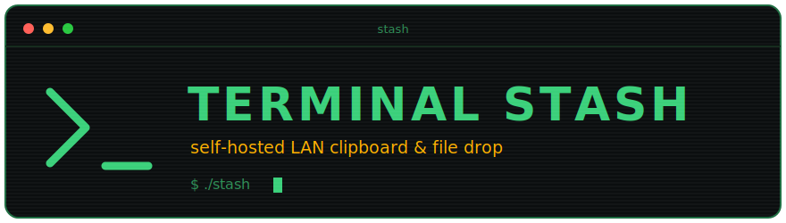

# Terminal Stash

<p align="center">
  
</p>

A minimalist, self-hosted **shared clipboard & file drop** for your home network.
Run it on your home server, open it in a browser on any machine, and copy text or
files between them. New items appear **live** on every open browser.

The UI is a compact terminal-style composer with a live, newest-first feed.

- Terminal / TUI aesthetic with 8 phosphor themes (green, amber, cyan, ice, ultraviolet, synthwave, matrix, mono — cycle in the top bar)
- Paste text, click to copy it back anywhere
- Drag-and-drop or paste files (and images) to upload; one-click download
- Live sync across machines via Server-Sent Events — no refresh
- Persists across restarts (SQLite + a Docker volume), with auto-pruning
- Single shared password
- One tiny static Go binary, fully dockerized

> **LAN-only.** There is no TLS and no per-user accounts by design. Do **not**
> expose this directly to the internet. If you need remote access, put it behind a
> reverse proxy / VPN / Cloudflare Tunnel that terminates HTTPS. The proxy must
> forward `X-Forwarded-Proto` (so the session cookie gets the `Secure` flag) and
> `X-Forwarded-For` (so login rate limiting and logs see real client IPs).

## Quick start (Docker)

### Run the published image

Every release publishes a multi-arch (amd64/arm64) image to
[Docker Hub](https://hub.docker.com/r/exbarboss/terminal-stash), tagged
`X.Y.Z`, `X.Y`, `X`, and `latest`. No clone needed:

```bash
docker run -d --name stash \
  -p 127.0.0.1:7827:7827 \
  -e APP_PASSWORD=something-only-you-know \
  -v stash-data:/data \
  exbarboss/terminal-stash:latest

# open http://localhost:7827 and log in with the password
```

`-p 127.0.0.1:7827:7827` keeps it reachable only from the host (typically
behind a reverse proxy or Cloudflare Tunnel running there). For direct LAN
access (`http://<your-server-ip>:7827`) use `-p 7827:7827` instead. Data
lives in the `stash-data` named volume. To update:

```bash
docker pull exbarboss/terminal-stash:latest
docker rm -f stash   # then re-run the docker run command above
```

### Build from source (compose)

```bash
# 1. set your password in a local .env file (git-ignored, never committed):
echo 'APP_PASSWORD=something-only-you-know' > .env

# 2. build & run
docker compose up --build -d

# 3. open http://localhost:7827 and log in with the password
```

By default the container port is bound to `127.0.0.1` only. For direct LAN
access, set `BIND_ADDR=0.0.0.0` in `.env`.

To pull updates later: `docker compose up --build -d`. Data lives in the
`stash-data` named volume and survives rebuilds.

## Run without Docker

Requires Go 1.26+.

```bash
make run
# equivalent to: APP_PASSWORD=test DATA_DIR=./data go run ./src
# → http://localhost:7827
```

## Development

Day-to-day commands live in the `Makefile` (`make help` lists everything).
The lint/security tools need no global install — they run via
`go run <module>@<version>`, pinned at the top of the Makefile.

| Command | What it does |
|---|---|
| `make install` | One-shot setup: Go modules, lint/security tools, e2e npm deps + Chromium |
| `make run` | Run the server locally on `:7827` (`APP_PASSWORD=test`) |
| `make build` | Build a static binary into `bin/stash` |
| `make test` | Unit + integration tests (`go test ./...`) |
| `make test-e2e` | Playwright browser end-to-end suite |
| `make fmt` | Format Go sources in place |
| `make check` | Pre-commit gate: gofmt, `go vet`, staticcheck, `go mod tidy` check, tests |
| `make audit` | Security checks: govulncheck + gosec |
| `make ci` | Everything except the browser e2e suite |
| `make docker-up` / `docker-down` | Build & start / stop the compose stack |

The e2e suite builds the binary itself, starts it on port 7832 with a clean
data dir, and covers login (including the rate-limit lockout), live SSE sync
across tabs, uploads/downloads, and CSP regressions.

## Configuration

All configuration is via environment variables:

| Variable | Default | Description |
|---|---|---|
| `APP_PASSWORD` | *(required)* | Shared password. The server refuses to start if unset. |
| `APP_USER` | `user` | Name shown in the UI's terminal prompt (`<name>@stash`). |
| `PORT` | `7827` | Listen port. |
| `DATA_DIR` | `/data` | Where the SQLite DB and uploaded files are stored. |
| `MAX_ITEMS` | `200` | Keep at most this many items; oldest are pruned. `0` = unlimited. |
| `MAX_AGE_DAYS` | `30` | Delete items older than this. `0` = never expire. |
| `MAX_UPLOAD_MB` | `100` | Reject uploads larger than this. |

## How it works

A single Go binary (`net/http`) serves an embedded vanilla HTML/CSS/JS frontend
and a small JSON API. Text snippets and file metadata are stored in SQLite
(pure-Go [`modernc.org/sqlite`](https://pkg.go.dev/modernc.org/sqlite), so the
binary is fully static with `CGO_ENABLED=0`); file blobs live next to the DB under
`DATA_DIR`. A shared-password login sets an HMAC-signed `HttpOnly` session cookie.
Changes are broadcast to connected browsers over an SSE stream.

### API

| Method | Path | Purpose |
|---|---|---|
| `POST` | `/api/login` | Authenticate (`{"password": "..."}`), sets session cookie |
| `POST` | `/api/logout` | Clear the session |
| `GET` | `/api/items` | List items (newest first) |
| `POST` | `/api/text` | Add a text snippet (`{"content": "..."}`) |
| `POST` | `/api/files` | Upload files (`multipart/form-data`, field `files`) |
| `GET` | `/api/files/{id}` | Download a file |
| `DELETE` | `/api/items/{id}` | Delete an item |
| `GET` | `/api/events` | SSE stream of `created` / `deleted` events |

## Notes

- Restarting the server invalidates existing login sessions (the cookie signing
  key is regenerated on each start) — just log in again. Sessions otherwise
  last 7 days.
- Failed logins are rate-limited per client IP (10 per 15 minutes) and logged.
- Pasted images are stored as file uploads.
- The scanline/glow effect is cosmetic CSS; cycle through the phosphor themes
  from the top bar (saved per browser).

## License

MIT
